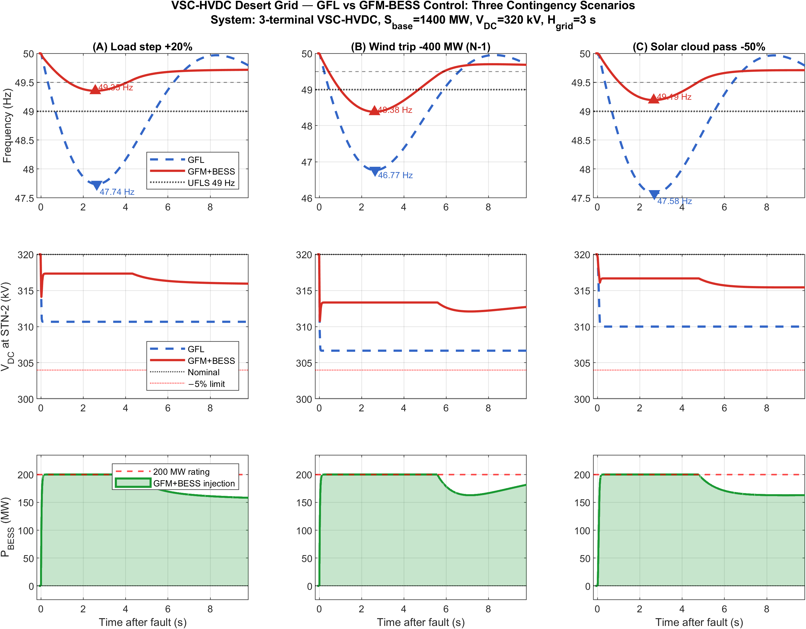
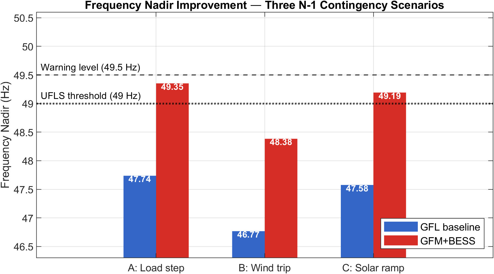
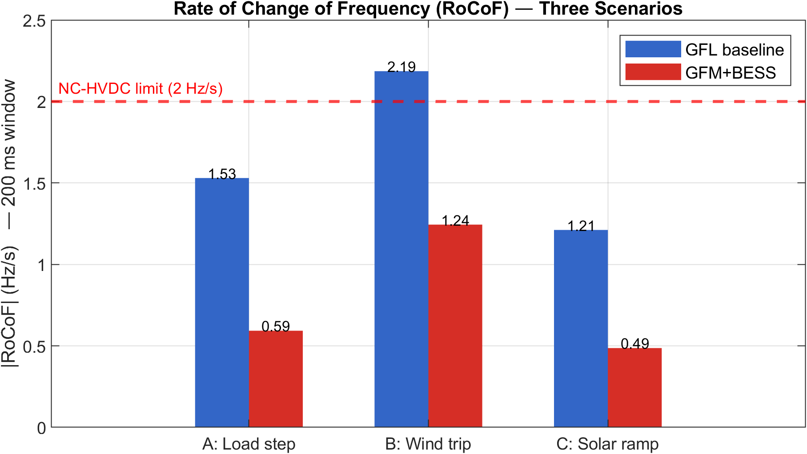
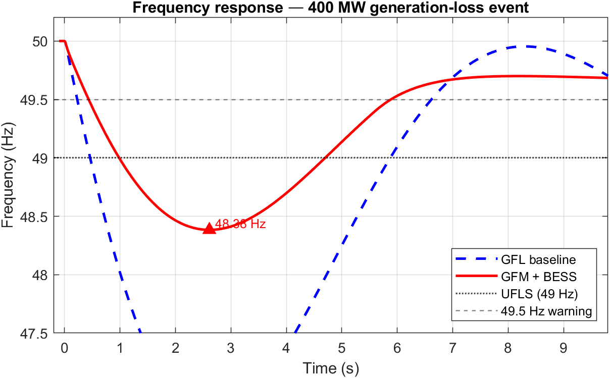
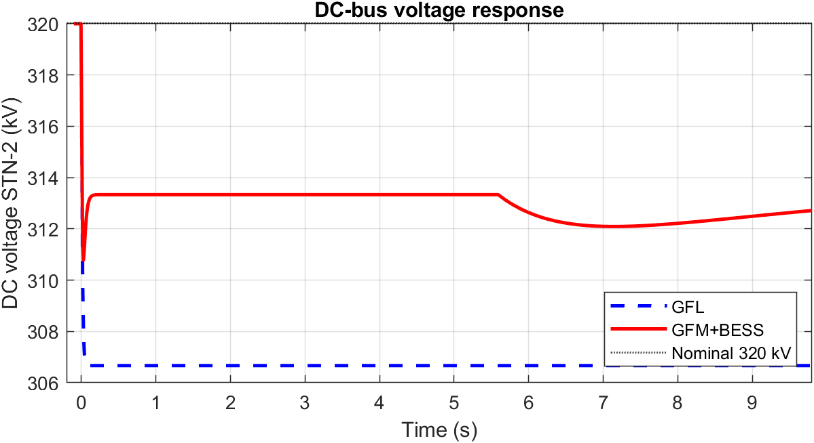
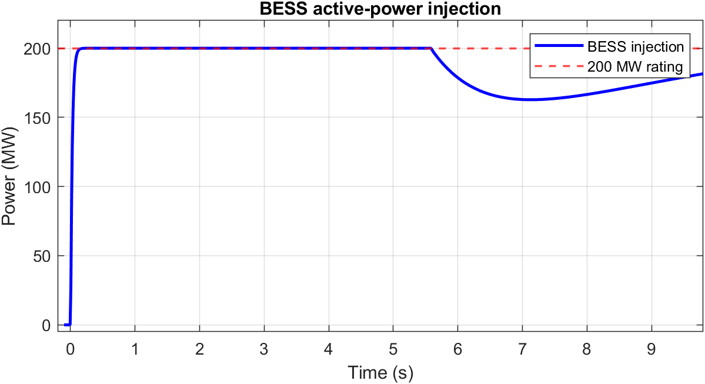
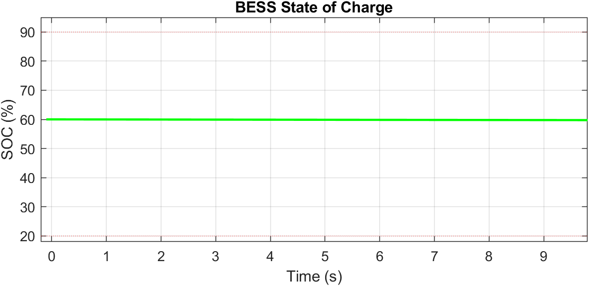

# 3-Terminal VSC-HVDC — Grid-Forming BESS Frequency Stability

**MATLAB/Simulink simulation study** — frequency stability analysis of a 3-terminal VSC-HVDC network under three N-1 contingency scenarios, comparing a Grid-Following (GFL) baseline against a Grid-Forming (GFM) control strategy using a Battery Energy Storage System (BESS) modeled as a Virtual Synchronous Machine (VSM).

> **Paper under peer review** — submitted to the *Journal of Undergraduate Research International* (JURI, KFUPM) — Ref. JURI-00314-2026-01

---

## Motivation

Large-scale solar and wind integration in the Middle East and North Africa (MENA) region relies on VSC-HVDC corridors to deliver power from remote generation sites to weak mainland AC grids. These grids have low synchronous inertia (H ≈ 3 s), making frequency stability a critical design constraint. This work quantifies how a BESS operating under Grid-Forming / VSM control can suppress frequency deviation, limit RoCoF, and prevent under-frequency load shedding (UFLS) under realistic generation-loss events.

---

## Network Topology

```
STN-1 (Offshore Wind)          STN-2 (DC Bus + BESS)         STN-3 (AC Mainland + Solar)
  800 MW rectifier  ──── DC 320 kV ────  BESS 200 MW/MWh  ──── inverter ────  1 400 MW weak grid
                                         VSM Control                            600 MW solar PV
```

| Parameter | Value |
|---|---|
| System base | 1 400 MW |
| DC bus voltage | 320 kV |
| AC grid inertia H | 3.0 s |
| Load damping D | 1.5 pu |
| Governor droop R | 6.7 % |
| BESS rating | 200 MW / 200 MWh |
| BESS SOC window | 20 % – 90 % |
| P–V droop k | 30 MW/kV |

---

## Control Architecture — Virtual Synchronous Machine (VSM)

The BESS converter at STN-2 emulates synchronous machine dynamics. The active-power reference is:

```
P_ref = Df · (−Δf / f₀) · Sbase  +  2·H_vsm · (−dΔf/dt / f₀) · Sbase
```

| VSM Parameter | Value | Description |
|---|---|---|
| H_vsm | 6.0 s | Virtual inertia constant |
| Df | 20.0 pu | Virtual damping gain |
| τ_b | 25 ms | Inner converter time constant |

SOC limits (20 %/90 %) are enforced: injection is blocked below SOC_min and absorption is blocked above SOC_max.

The **GFL baseline** keeps BESS passive (dP_bess/dt = 0), relying solely on the governor and P–V droop for frequency regulation.

---

## Contingency Scenarios

| Scenario | Event | Magnitude | Profile |
|---|---|---|---|
| **A** | Load step | +280 MW (+20 %) | Instantaneous |
| **B** | Wind trip (N-1) | −400 MW | Instantaneous |
| **C** | Solar cloud pass | −300 MW (−50 %) | Linear ramp, 100 ms |

---

## Key Results

### Three-scenario comparison panel



*Rows: frequency (Hz), DC bus voltage at STN-2 (kV), BESS active-power injection (MW). Columns: scenarios A, B, C. Blue dashed = GFL baseline; red solid = GFM+BESS.*

### Frequency nadir



GFM+BESS keeps the frequency nadir above the UFLS threshold (49 Hz) in all three scenarios. GFL baseline triggers load shedding in scenario B.

### Rate of Change of Frequency (RoCoF)



GFM+BESS reduces RoCoF below the NC-HVDC limit (2 Hz/s) across all contingencies through virtual inertia injection in the first 200 ms after the fault.

### Single-scenario detail (Scenario B — wind trip)

| Metric | GFL | GFM+BESS |
|---|---|---|
| Frequency nadir (Hz) | < 49.0 ✗ | > 49.0 ✓ |
| UFLS triggered | Yes | No |
| RoCoF (Hz/s) | > 2.0 | < 2.0 |
| BESS peak power | — | ≤ 200 MW |






---

## Repository Structure

```
.
├── hvdc_gfm_bess.slx          # Simulink model (Simscape Electrical, AVM)
├── hvdc_gfm_bess_sim.m        # Main script — GFL vs GFM, single scenario
├── hvdc_scenarios.m           # 3-scenario sweep — paper Figures 3–5
├── sim_postprocess.m          # Post-process Simulink output vs ODE baseline
├── build_hvdc_simulink.m      # Programmatic Simulink model builder
├── set_scenario.m             # Workspace parameter setter for Simulink
├── run_via_mcp.m              # Batch run helper
└── figures/                   # Generated plots (300 dpi PNG, paper-ready)
    ├── fig_scenarios_3x3.png
    ├── fig_nadir_comparison.png
    ├── fig_rocof_comparison.png
    ├── fig_frequency_response.png
    ├── fig_dc_voltage.png
    ├── fig_bess_power.png
    └── fig_soc.png
```

---

## How to Reproduce

**Requirements:** MATLAB R2023b or later, Simulink, Simscape Electrical.

```matlab
% 1. Reduced-order ODE model — GFL vs GFM, single 400 MW contingency
cd matlab_sim
run('hvdc_gfm_bess_sim.m')

% 2. Three-scenario sweep — regenerates all paper figures
run('hvdc_scenarios.m')

% 3. Simulink model — open, run (Ctrl+T), then post-process
open('hvdc_gfm_bess.slx')
% After simulation completes:
run('sim_postprocess.m')
```

All scripts are self-contained. Parameters are defined at the top of each file and documented inline.

---

## ODE Model — State Variables

The reduced-order model uses 5 states solved with `ode23tb` (stiff solver):

| State | Symbol | Units | Description |
|---|---|---|---|
| x(1) | Δf | Hz | Frequency deviation from nominal (50 Hz) |
| x(2) | ΔV_dc | kV | DC bus voltage deviation from 320 kV |
| x(3) | P_bess | MW | BESS active power injection |
| x(4) | SOC | — | Battery state of charge [0, 1] |
| x(5) | P_gov | MW | Governor primary response power |

---

## Citation

If you use this code or build on this work, please cite:

```
B. Diaw, "Grid-Forming BESS Control for Frequency Stability in a 3-Terminal
VSC-HVDC Desert Grid," Journal of Undergraduate Research International (JURI),
KFUPM, 2026. Ref. JURI-00314-2026-01. Under peer review.
```

---

## Author

**Birane Diaw** — Electrical Engineering (LST-IEEA), FST Marrakech, Université Cadi Ayyad  
[GitHub](https://github.com/diawbirane10-lgtm) · [Portfolio](https://bdiaw.lovable.app)

---

*Simulation conducted for academic research purposes. System parameters are representative of MENA/Gulf VSC-HVDC corridors. Not a real grid model.*
